# World Cup 2026 - Immediate's Team Draw Website

This is the Immediate website for the 2026 World Cup games.

Here you could register and contribute a small sum (£5) to a shared pot and get random assignment of a team out of the 32 countries participating. Whoever's team is the winner will get the whole amount.

The website will also provide details on the different matches in the different stages of the tournament, from the group stage all the way to the final.

---

## Registration and Payment

You do that by navigating to https://sysqo82.github.io/World-Cup-2026/ and using the form to register.

Once registered you'll need to pay the fee by clicking on the "make a payment" button where you'll be redirected to the Monzo website for payment.

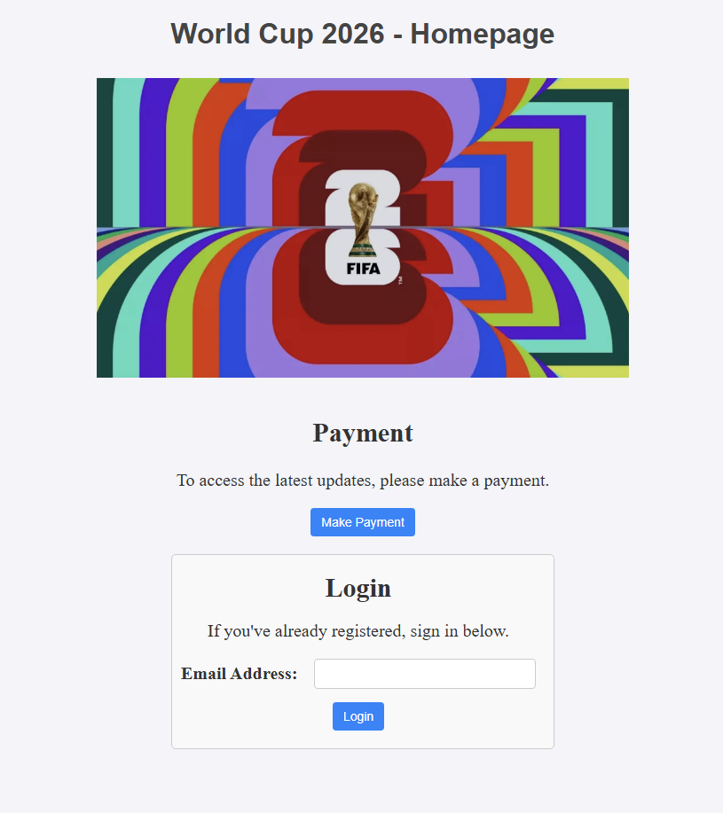

Only after Assaf verified you paid, you'll be given permission to login.

---

## Login

To login, you'll need to enter your registered email address in the login form. A verification email will be sent with a code (which expires after 10 minutes) to the registered email inbox with a 6 digit code. You'll need to enter it into the form and only then you will be able to login (once logged in, you won't need to login again on that browser, unless you clear your cookies).

Example of the email you'll get:

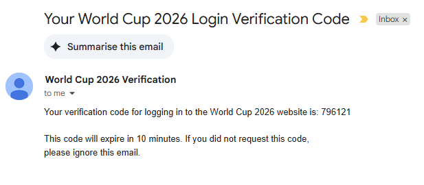

Once the code is verified, you'll see what country you've been drawn (it's fully randomised and even I don't know what country you're given) and the amount in the prize pot.

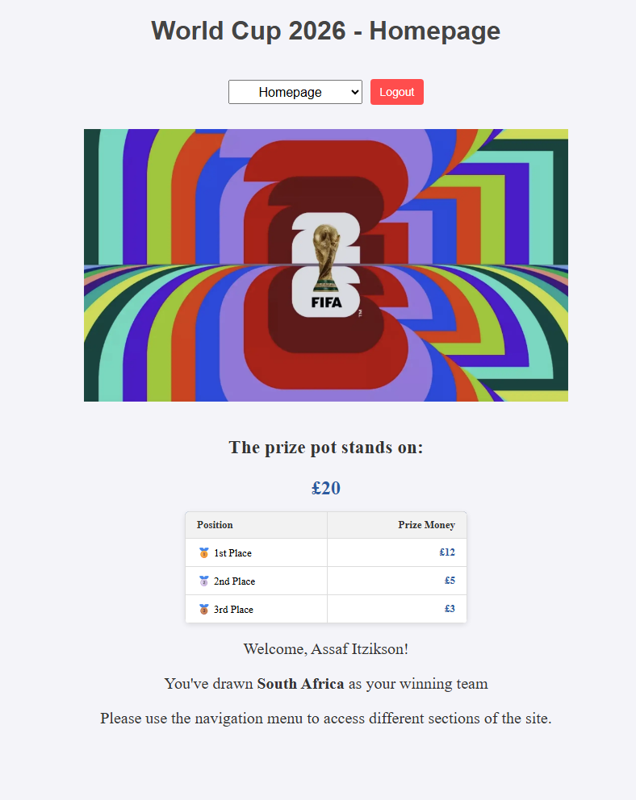

After that you can use the navigation menu to navigate between the different pages on the website.

---

## What else can you find on the website?

### My Account

In my account you can do various things:

1. Subscribe or unsubscribe from emails regarding results of matches for your team
2. Change your registered email (this will not change your drawn team)
3. View matches just about your team

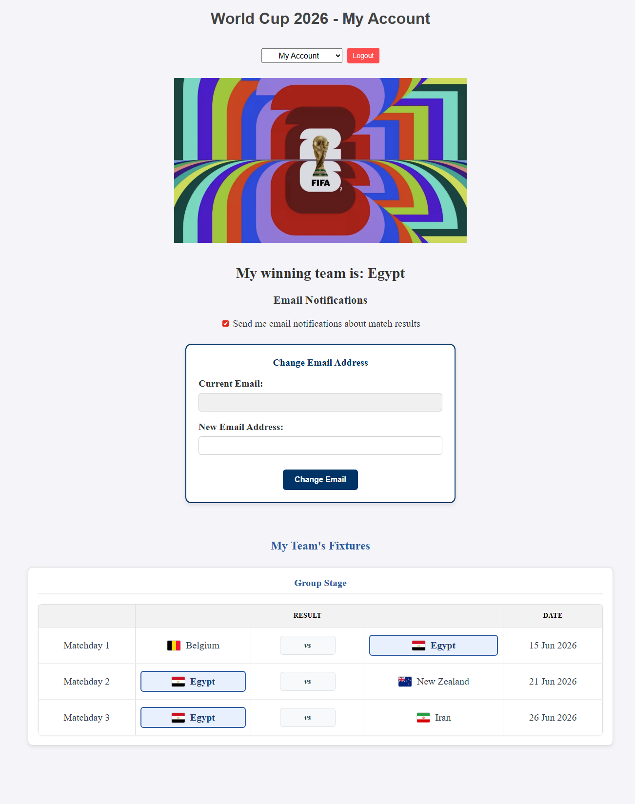

In my account you could also see if your drawn team has made it into the next stage or not, and how they did.

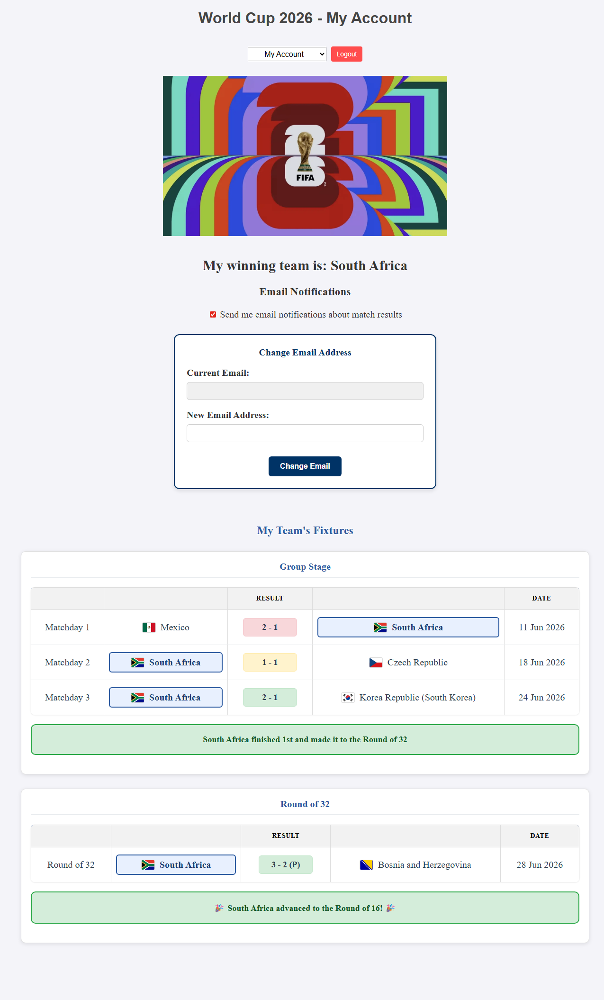

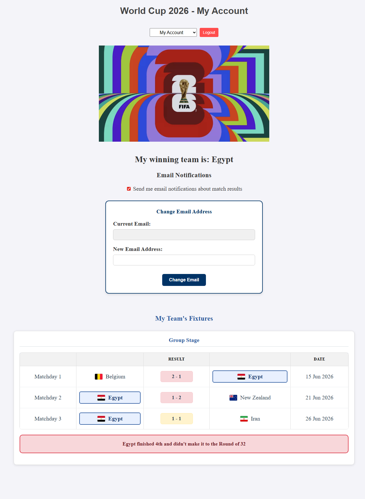

---

### Group Stage

In the group stage screen you can view the tables and all of the teams in the tournament plus all of the matches that they'll have with the dates of the match.

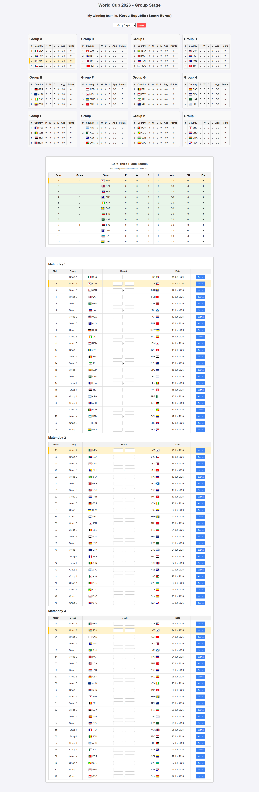

The tables are ordered according to the FIFA ranking when they drew it. The ranking afterwards will be determined by the result of the matches they played, and the points are calculated according to the FIFA regulations (if 2 teams have the same points, their ranking in the group will be determined by goal aggregate).

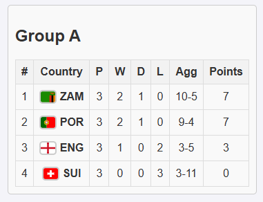

If you hover over the official FIFA 3 letter name code, you can see the name of the country.

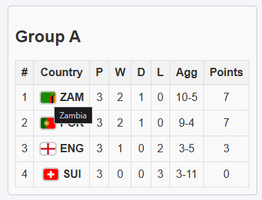

On the matchday section, you can see the whole group stage matches and the dates. You could also see what team won, lost and had a draw.

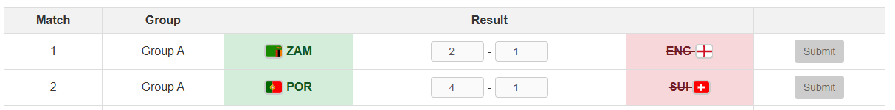

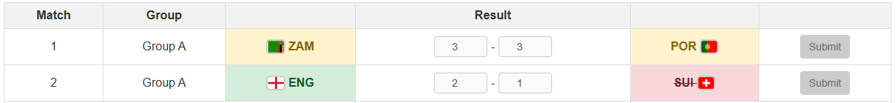

---

### Other Stages

#### Round of 16

If you're lucky and your drawn team has made it into the next stage, you can continue following the tournament here.

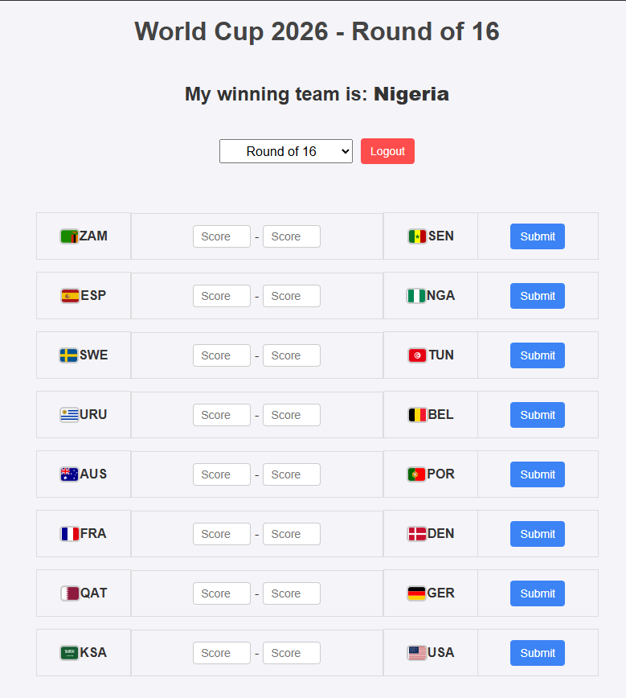

In this stage, there can only be a winning team or a losing team and matches can drag into extra time or even penalty shootout to determine the winner and loser.

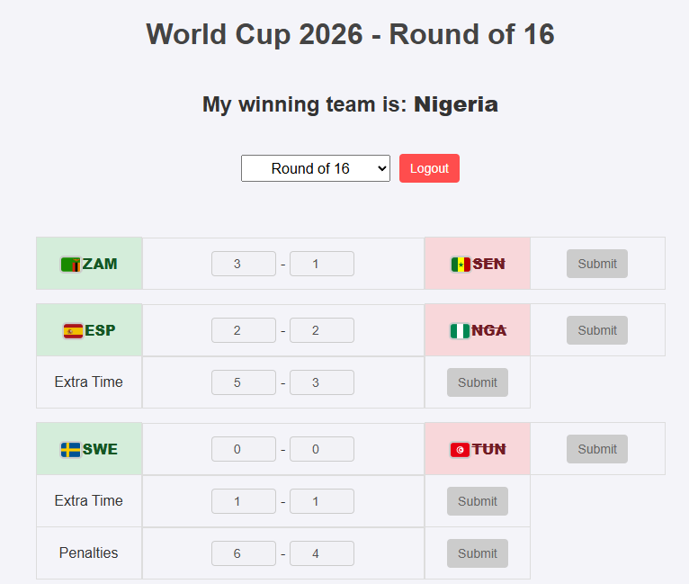

---

## Email Notifications

When you register you gave us permission to send you emails regarding match results of your drawn team. Those emails are light in text and will have all of the information you'll need. They'll be appropriately named and be personalised to you and your team and stage in the competitions.

For example:

If your team won, lost or the match ended up in the draw in the group stage you'll get these kind of emails:

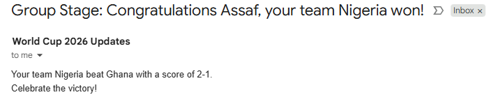

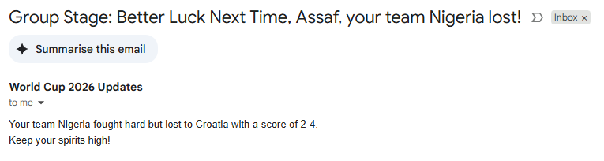

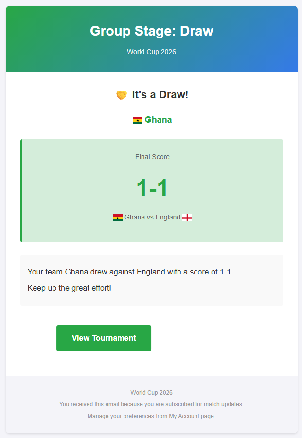

Email for the next stages will also include the next stage that your team made it to (if they won):

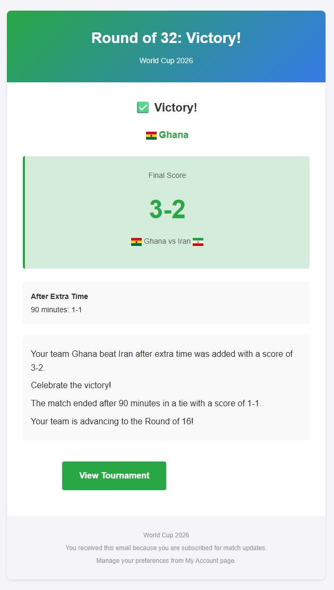

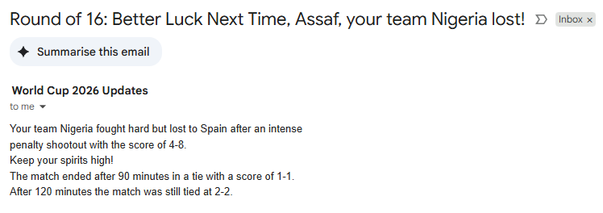

---

## Admin Page

There is also an admin page where the admins of the site can manage the teams in the tournament and the registered users. Admins can approve users after payment and remove them from the tournament.

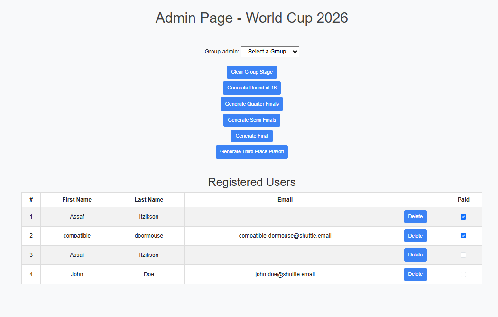